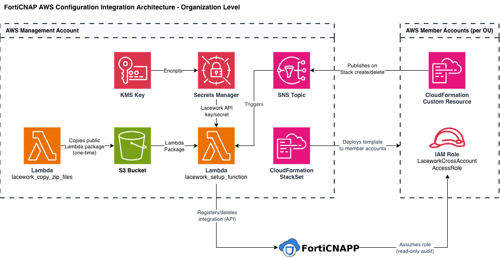

# Lacework AWS Config Integration - Organization-Level

## Overview

This integration enables Lacework to continuously assess AWS resource configurations for security and compliance across your entire AWS Organization. When deployed, Lacework gains read-only visibility into every member account you specify — automatically covering new accounts as they join and cleaning up when accounts are removed. No per-account manual setup is required.

The integration is deployed once into your AWS management account. From there, a CloudFormation StackSet distributes the necessary IAM role and policies to all accounts in your chosen Organizational Units (OUs). An event-driven Lambda pipeline registers each account with the Lacework platform automatically.

---

## Architecture

The integration has two layers: resources in the **management account** that orchestrate everything, and a **member template** deployed by StackSet to every monitored account.



The SNS topic is the communication bus between the member accounts and the management account. Every time a member stack is created or deleted, the custom resource publishes a message to this topic, which triggers the setup Lambda to call the Lacework API.

---

## How the Integration Is Established

When the Terraform module is applied, the following sequence occurs:

### 1. Management Account Infrastructure

The module creates the foundational components in the management account:

- A **private S3 bucket** (versioning enabled, public access blocked) to hold the Lambda deployment package.
- A **KMS key** to encrypt data at rest across SNS and Secrets Manager. You can supply an existing key via `kms_key_arn` if you prefer.
- An **AWS Secrets Manager secret** containing your Lacework API credentials. These credentials are encrypted at rest with the KMS key and accessed by the setup Lambda at runtime — they are never stored in environment variables or passed in plaintext.
- An **SNS topic** scoped to your AWS Organization (via `aws:PrincipalOrgID` policy condition) that acts as the event bus for account lifecycle notifications.

### 2. Lambda Bootstrap

A one-shot Lambda function (`lacework_copy_zip_files`) runs immediately after creation. It copies the Lacework integration package from Lacework's public S3 bucket (`lacework-alliances`) into the private org-owned bucket. This ensures the setup Lambda can be deployed from a private, org-controlled source.

### 3. Setup Lambda

The `lacework_setup_function` Lambda is deployed and subscribed to the SNS topic. This is the single function responsible for all interactions with the Lacework API throughout the lifetime of the integration — it handles account registration, updates, and removal.

### 4. StackSet Deployment to Member Accounts

A CloudFormation StackSet is created with `SERVICE_MANAGED` permissions. This means AWS automatically handles the cross-account service-linked roles needed to deploy into member accounts — no manual per-account setup is required. The StackSet deploys the member template to every account in the specified OUs, with configurable parallelism (default: up to 50 accounts concurrently).

### 5. Per-Account Registration

For each member account, the StackSet creates a CloudFormation stack that provisions:

- A **cross-account IAM role** (`LaceworkCrossAccountAccessRole`) with a unique External ID.
- **Read-only IAM policies** attached to that role (described in detail below).
- A **CloudFormation custom resource** that, upon stack creation, publishes an SNS message containing the role ARN, External ID, and AWS account ID to the management account's SNS topic.

### 6. Lacework API Registration

The SNS message triggers `lacework_setup_function`. The Lambda deliberately waits 5 minutes before calling the Lacework API to allow IAM role propagation to complete across AWS's global infrastructure. It then calls the Lacework API (`POST /api/v2/CloudAccounts`) to create an `AwsCfg` integration for that account. From this point, Lacework begins assessing the account's resource configurations.

---

## How the Cross-Account Trust Works

### The IAM Role

Each member account contains a `LaceworkCrossAccountAccessRole`. Its trust policy allows Lacework's platform AWS account (`434813966438`) to assume it. The role grants only read-only access — Lacework cannot modify any resources in your accounts.

The permissions consist of:

| Policy | Source | Coverage |
|---|---|---|
| `SecurityAudit` | AWS managed | Broad read-only audit permissions across core services |
| Custom audit policies | Created by StackSet | Additional read-only permissions across 200+ AWS services including CloudTrail, EKS, Lambda, DynamoDB, WAF, Inspector, IoT, Step Functions, and more |

No write, delete, or mutating permissions are included.

### External ID Protection

Each role's trust policy is further restricted by a unique **External ID**:

```
lweid:aws:v2:{LaceworkAccount}:{MemberAccountId}:LW{StackToken}
```

This ID is derived from your Lacework account name, the member's AWS account ID, and a token from the CloudFormation stack — making it unique per account and per deployment. Lacework's platform must present this exact ID when assuming the role. This prevents [confused-deputy attacks](https://docs.aws.amazon.com/IAM/latest/UserGuide/confused-deputy.html), where a third party might trick Lacework into accessing your account.

---

## How New Accounts Are Automatically Onboarded

The integration is fully event-driven after initial setup. No manual action is needed when your organization changes.

**New account added to a monitored OU**

AWS Organizations automatically triggers the StackSet to deploy the member template to the new account. Once CloudFormation creates the stack, the custom resource fires, publishes to SNS, and the setup Lambda registers a new integration with Lacework. The account becomes visible in Lacework within minutes.

**Account removed from a monitored OU**

The StackSet automatically deletes the member stack from the account. The custom resource fires a Delete event to SNS, and the setup Lambda calls the Lacework API to remove the integration. The account stops appearing in Lacework assessments.

**Account moved between OUs**

If an account moves into a monitored OU, the integration is created. If it moves out, the integration is deleted. This follows the same SNS-driven flow described above.

---

## Security Design

**Least-privilege IAM**
The cross-account role in each member account is strictly read-only. No write, delete, create, or IAM management permissions are granted to Lacework at any point.

**Per-account External ID**
Every member account's IAM role uses a unique External ID derived from the Lacework account name, AWS account ID, and CloudFormation stack token. This prevents confused-deputy attacks and ensures one deployment cannot impersonate another.

**Encrypted credentials**
Lacework API credentials are stored in Secrets Manager, encrypted with the KMS key. The setup Lambda retrieves them at runtime via the AWS SDK — credentials never appear in Lambda environment variables, Terraform state values, or CloudFormation parameters in plaintext.

**Organization boundary enforcement**
Both the SNS topic policy and the KMS key policy use the `aws:PrincipalOrgID` condition to restrict access exclusively to principals within your AWS Organization. Entities outside your organization cannot publish to the topic or use the key.

**Private Lambda assets**
The S3 bucket holding the Lambda deployment package has all public access blocked. The package is copied from Lacework's public bucket once at deploy time and served privately thereafter.

---

## Troubleshooting

**Integration not appearing in Lacework Console**
The setup Lambda intentionally waits 5 minutes for IAM role propagation before calling the API — this is expected. Check the `lacework_setup_function` CloudWatch log group in the management account for API errors after that window.

**StackSet deployment fails for some accounts**
Check CloudFormation stack events in the affected member account. Common causes include Service Control Policies (SCPs) that block IAM role creation, or missing AWS Organizations trust in the management account. The `stackset_failure_tolerance_count` variable controls how many per-account failures are tolerated before the entire StackSet operation is marked as failed.

**KMS or SNS permission errors in member accounts**
Both the KMS key policy and the SNS topic policy gate access using `aws:PrincipalOrgID`. If member accounts cannot publish to SNS or decrypt data, verify that the `organization_id` variable matches your actual AWS Organization ID exactly.

**Lacework API authentication errors**
Verify that `lacework_account` is set to the account name only, without the `.lacework.net` suffix. Check the Secrets Manager secret in the management account to confirm the API credentials are valid and the key has not been rotated or revoked in the Lacework Console.
